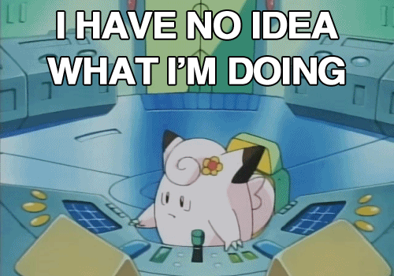
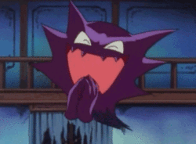

```{r setup, include=FALSE}
source(here::here("_R/blog_setup.R"))
```


**Update**: This is an update for the [original post](https://web.archive.org/web/20190302094835/http://jkunst.com/r/pokemon-visualize-em-all/) 
using the new highcharter API.

Time ago, when I was a younger man I know pokemon I konw the 150 pokemon then I And more than 10 year there are over 700 with new types new, new regions, etc. So to know the status of all these monsters I download the data and make some chart and see te actual status.

```{r, echo=FALSE, layout="l-body"}

```


## Data

There is a pokemon api http://pokeapi.co/. But we want all the pokemon data once so we can go to the repository I found the raw data https://github.com/phalt/pokeapi/tree/master/data/v2/csv . We’ll need other type of data like type’s colors, icon images. This data we founded here http://bulbapedia.bulbagarden.net/wiki/List_of_Pok%C3%A9mon_by_base_stats_(Generation_VI-present) and http://pokemon-uranium.wikia.com/wiki/Template:fire_color.


```{r}
library(tidyverse)
library(highcharter)

path <- function(x) paste0("https://raw.githubusercontent.com/phalt/pokeapi/master/data/v2/csv/", x)

dfpkmn <- read_csv(path("pokemon.csv")) %>% 
  select(-order, -is_default) %>% 
  rename(pokemon = identifier)

dfstat <- read_csv(path("stats.csv")) %>% 
  rename(stat_id = id) %>% 
  right_join(
    read_csv(path("pokemon_stats.csv")),
    by = "stat_id"
    ) %>% 
  mutate(identifier = str_replace(identifier, "-", "_")) %>% 
  select(pokemon_id, identifier, base_stat) %>% 
  spread(identifier, base_stat) %>% 
  rename(id = pokemon_id)

dftype <- read_csv(path("types.csv")) %>% 
  rename(type_id = id) %>% 
  right_join(
    read_csv(path("pokemon_types.csv")),
    by = "type_id"
    ) %>% 
  select(pokemon_id, identifier, slot) %>% 
  mutate(slot = paste0("type_", slot)) %>% 
  spread(slot, identifier) %>% 
  rename(id = pokemon_id)

dfegg <- read_csv(path("egg_groups.csv")) %>% 
  rename(egg_group_id = id) %>% 
  right_join(
    read_csv(path("pokemon_egg_groups.csv")),
    by = "egg_group_id"
    ) %>% 
  group_by(species_id) %>% 
  mutate(
    ranking = row_number(),
    ranking = paste0("egg_group_", ranking)
    ) %>% 
  select(species_id, ranking, identifier) %>% 
  spread(ranking, identifier)
```


Now some other details:

```{r, cache=TRUE}
library(rvest)

dfimg <- "https://github.com/phalt/pokeapi/tree/master/data/Pokemon_XY_Sprites" %>% 
  read_html() %>% 
  html_nodes("tr.js-navigation-item > .content > .css-truncate a") %>% 
  map_df(function(x){
    url <- x %>% html_attr("href")
    tibble(
      id = str_extract(basename(url), "\\d+"),
      url_image = basename(url)
    )
  }) %>%
  mutate(id = as.numeric(id))

url_bulbapedia_list <- "http://bulbapedia.bulbagarden.net/wiki/List_of_Pok%C3%A9mon_by_base_stats_(Generation_VI-present)" 

id <- url_bulbapedia_list %>% 
  read_html(encoding = "UTF-8") %>% 
  html_node("table.sortable") %>% 
  html_table() %>% 
  .[[1]] %>% 
  as.numeric()

url_icon <-  url_bulbapedia_list %>% 
  read_html() %>%
  html_nodes("table.sortable img") %>% 
  html_attr("src")

dficon <- tibble(id, url_icon) %>% 
  filter(!is.na(id)) %>% 
  distinct(id, .keep_all = TRUE) %>% 
  mutate(url_icon = str_c("https:", url_icon))

types <- dftype %>% 
  select(-id) %>% 
  distinct() %>% 
  gather() %>% 
  distinct(value) %>%
  filter(!is.na(value)) %>% 
  pull()

dfcolor <- map_dfr(types, function(t){
  # t <- "psychic"
  message(t)
  col <- "http://pokemon-uranium.wikia.com/wiki/Template:%s_color" %>% 
    sprintf(t) %>%
    read_html() %>% 
    html_nodes("span > b") %>% 
    html_text()
  tibble(type = t, color = paste0("#", col))
})

dfcolorf <- crossing(
  color_1 = dfcolor$color,
  color_2 = dfcolor$color
  ) %>% 
  mutate(
    color_f =
      map2_chr(
        color_1,
        color_2,
        ~ colorRampPalette(c(.x, .y))(100)[round(100 * .25)])
    )
  
# THE join
data <- dfpkmn %>% 
  left_join(dftype, by = "id") %>% 
  left_join(dfstat, by = "id") %>% 
  left_join(dfcolor %>% rename(type_1 = type, color_1 = color), by = "type_1") %>% 
  left_join(dfcolor %>% rename(type_2 = type, color_2 = color), by = "type_2") %>% 
  left_join(dfcolorf, by =  c("color_1", "color_2")) %>%  
  left_join(dfegg, by = "species_id") %>% 
  left_join(dfimg, by = "id") %>% 
  left_join(dficon, by = "id")
```

```{r, include=FALSE}
# rm(dftype, dfstat, dfcolor, dfcolorf, dfegg, dfimg, dficon, dfpkmn)
# rm(id, url_bulbapedia_list, url_icon)
```

Finally we remove the pokemon with no images, like the mega ones).

```{r}
data <- data %>% 
  mutate(color_f = ifelse(is.na(color_f), color_1, color_f)) %>% 
  filter(!is.na(url_image)) 

glimpse(data)
```

## **Bar chart** I choose you!

We’ll start with the most simple of chart. Let’s count the pkmns by its main type.

```{r}
dstype <- data %>% 
  count(type_1, color_1) %>% 
  ungroup() %>% 
  mutate(type_1 = str_to_title(type_1)) %>% 
  arrange(desc(n)) 

hchart(dstype, "bar", hcaes(x = type_1, y = n, color = color_1)) %>% 
  hc_xAxis(title = list(text = "Type")) %>% 
  hc_yAxis(title = list(text = "Amount"))
```

Ehm... Nothing new: A lot of water and normal pkmns and a few with fly as main type.

## Oh! The **Bar chart** has evolved into a **Treemap**

Now, lets include in some way the second type of each pkmn. An alternative to do this is using a treemap. So here we’ll use the treemap package to get the information.

```{r}
dtm <- data %>% 
  mutate(
    type_2 = ifelse(is.na(type_2), type_1, type_2),
    type_1 = str_c("main : ", type_1),
    ) %>% 
  group_by(type_1, type_2, color_f) %>%
  summarise(n = n()) %>%
  ungroup() %>% 
  mutate_if(is.character, str_to_title) 

tm <- hctreemap2(
  dtm,
  group_vars = c("type_1", "type_2"),
  size_var = "n",
  layoutAlgorithm = "squarified",
  levelIsConstant = FALSE,
  levels = list(
    list(level = 1, dataLabels = list(enabled = TRUE), borderWidth = 3),
    list(level = 2, dataLabels = list(enabled = FALSE), borderWidth = 1)
    )
  )

tm
```

That's the default output. Now let’s tweak the treemap result to include the respective color to each type so we have a more *fun* chart.

This part it's tricky: We need to access every item in the data in the highcharter/highcharts
object and change the color one by one using the 

```{r}
tm$x$hc_opts$series[[1]]$data <- tm$x$hc_opts$series[[1]]$data %>% 
  map(function(x){
    
    # x <- sample(tm$x$hc_opts$series[[1]]$data, size = 1) %>% first()
    # str(x)
    
    if(x$level == 2) {
      x$color <- dtm %>% 
        filter(type_1 == x$type_1, type_2 == x$type_2) %>% 
        pull(color_f)
    } 
    
    x 
    
  })

tm$x$hc_opts$colorAxis <- NULL

tm <- tm %>% 
  hc_plotOptions(
    series = list(
      dataLabels = list(
        style = list(textOutline = FALSE)
      )
    )
  ) %>% 
  # this is to remove the hover effect by the default color
  hc_colors("transparent")

tm
```


## A wild **T-SNE** appears!

I met t-SNE (t-Distributed Stochastic Neighbor Embedding) algorithm in a Kaggle post. It was developed by Laurens van der Maaten and according the official package (https://lvdmaaten.github.io/tsne/) it’s a prize winning algorithm. In the site the description mention:

> It is particularly well suited for the visualization of high-dimensional datasets

So, it’s just use the algorithm and see what happend, right? We’ll select some variables and use the model.matrix to convert the strings variable into indicators for each level and apply the dimensional reduction algorithm.

```{r, cache=TRUE}
library(smallvis)

tsne_poke <- data %>%
  select(
    type_1, type_2, weight, height, base_experience,
    attack, defense, special_attack, special_defense,
    speed, base_experience, hp,
    egg_group_1, egg_group_2
  ) %>% 
  mutate_all(replace_na, "NA") %>% 
  model.matrix(~., data = .) %>% 
  as.data.frame() %>% 
  as_tibble() %>% 
  select(-1)

tsne_poke_coords <- smallvis(tsne_poke, method = "tsne", epoch_callback = FALSE)
```

Let's plot the data to see what we got.


```{r,layout="l-body"}
data <- data %>% 
  mutate(
    x = tsne_poke_coords[, 1],
    y = tsne_poke_coords[, 2]
    )

dfcenters <- data %>% 
  group_by(type_1, color_1) %>% 
  summarise(cx = mean(x),
            cy = mean(y),
            sdcx = sd(x),
            sdcy = sd(y))

cols <- data %>% 
  select(type_1, color_1) %>% 
  distinct() %>% 
  deframe()

gg <- ggplot(data) + 
  geom_point(aes(x, y, color = type_1), size = 4, alpha = 0.5) +
  scale_color_manual("Type", values = cols) +
  geom_text(data = dfcenters, aes(cx, cy, label = type_1)) +
  theme_minimal() +
  theme(legend.position = "right") +
  facet_wrap(~type_1) 

gg
```

As we can see the algorithm grouped pokemon according to their main type.
Every group look relative concentrated except the *dragon*, *fairy*, *poison* and *steel*. 
I think this can be beacuse this types of pokemon have a second and variable so they are not so similiar among them.

There will be more in this result? Now it’s time to put all the download images in a chart and explore the output.


```{r}
dmin <- data %>% 
  select(
    pokemon, type_1, type_2, weight, height,
    attack, defense, special_attack, special_defense,
    url_image, url_icon, color = color_1, x, y
    ) %>% 
  mutate(
    marker =  map(url_icon, ~ list(symbol = sprintf("url(%s)", .x))) 
  )
  
xt <- c(
  "pokemon", "type_1", "type_2",
  "weight", "height", "attack",
  "defense", "special_attack",
  "special_defense"
  )

yt <- str_c("{point.", xt, "}")

tb <- tooltip_table(xt, yt)

library(htmltools)

urlimage <- "https://raw.githubusercontent.com/phalt/pokeapi/master/data/Pokemon_XY_Sprites/"

tb <- tagList(
  tags$img(
    src = paste0(urlimage, "{point.url_image}"),
    width = "150px", height = "125px")
  ) %>% 
  as.character() %>% 
  str_c(tb, .)
```

The details are ready. Now to chart!

```{r, layout="l-page", fig.height=10}
highchart() %>% 
  hc_chart(zoomType = "xy") %>% 
  hc_xAxis(
    visible = FALSE,
    minRange = diff(range(data$x))/5
    ) %>%
  hc_yAxis(
    visible = FALSE,
    minRange = diff(range(data$y))/5
    ) %>%
  hc_tooltip(
    useHTML = TRUE,
    borderRadius = 0,
    borderWidth = 5,
    headerFormat = "",
    pointFormat = tb,
    footerFormat = ""
  ) %>% 
  hc_add_series(
    dmin,
    "point",
    hcaes(x, y, name = pokemon, color = color, group = type_1),
    states = list(
      hover = list(
        halo = list(
          size  = 50,
          attributes = list(opacity = 1)
          )
        )
      )
    ) %>%
  hc_add_series(
    dmin %>% select(x, y, color) %>% mutate(z = 1),
    "bubble",
    minSize = 100,
    showInLegend = FALSE,
    hcaes(x, y, color = color),
    marker = list(fillOpacity = 0.05, lineWidth = NULL),
    zIndex = -3,
    enableMouseTracking = FALSE
    ) 
```


I see nice things here, like the cluster are detrmined by the type of pokemon or
the algorithm put some chain evolution side by side.

I’m happy with the result. Nice algorithm to keep testing in other data!


```{r, echo=FALSE, layout = "l-body"}

```

