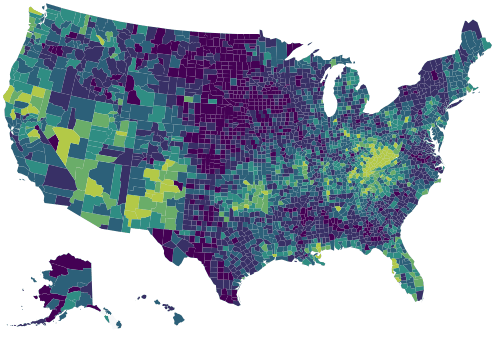

```{r setup, include=FALSE}
knitr::opts_chunk$set(echo = TRUE)
source(here::here("_R/blog_setup.R"))
```

Time ago hrbrmstr show how to replicate a visualization made by 
[New York Times](http://www.nytimes.com/interactive/2016/01/07/us/drug-overdose-deaths-in-the-us.html?_r=0) 
with R.

<blockquote class="twitter-tweet" data-lang="en"><p lang="en" dir="ltr">The <a href="https://twitter.com/nytgraphics">@nytgraphics</a> folks are spiffy.so is <a href="https://twitter.com/hashtag/rstats?src=hash">#rstats</a> <a href="https://t.co/zc1gIx6cyE">https://t.co/zc1gIx6cyE</a> <a href="https://t.co/XAmVPDLfC7">https://t.co/XAmVPDLfC7</a> <a href="https://twitter.com/hashtag/tigrisviridisggplot?src=hash">#tigrisviridisggplot</a> <a href="https://t.co/9ZK6wvYDnh">pic.twitter.com/9ZK6wvYDnh</a></p>&mdash; boB Rudis (@hrbrmstr) <a href="https://twitter.com/hrbrmstr/status/713183027816439808">March 25, 2016</a></blockquote>
<script async src="http://platform.twitter.com/widgets.js" charset="utf-8"></script>

The result we hope is like this:



I really like small multiples and this is a good example of usage. However if the 
multiples means a lot mini plots maybe you can try add animation. 

Let's start using the [script](https://gist.github.com/hrbrmstr/a61991ebd8f4f49ce739) made by Bob:

```{r}
library(jsonlite)
library(dplyr)
library(tidyr)
library(highcharter)

URL <- "http://graphics8.nytimes.com/newsgraphics/2016/01/15/drug-deaths/c23ba79c9c9599a103a8d60e2329be1a9b7d6994/data.json"

data("uscountygeojson")
data("unemployment")

data <-  fromJSON(URL) %>% 
  tbl_df() %>% 
  gather(year, value, -fips) %>% 
  mutate(year = sub("^y", "", year),
         value = ifelse(is.na(value), 0, value))

data
```


Now we'll prepare the data as the [motion plugin](http://www.highcharts.com/plugin-registry/single/40/Motion) 
require the data.

```{r}
ds <- data %>% 
  group_by(fips) %>% 
  do(item = list(
    fips = first(.$fips),
    sequence = .$value,
    value = first(.$value))) %>% 
  .$item

hc <- highchart(type = "map") %>% 
  hc_add_series(
    data = ds,
    name = "drug deaths per 100,000",
    mapData = uscountygeojson,
    joinBy = "fips",
    borderWidth = 0.01
    ) %>% 
  hc_colorAxis(stops = color_stops()) %>%  
  hc_title(text = "How the Epidemic of Drug Overdose Deaths Ripples") %>% 
  hc_subtitle(text = "Overdose deaths per 100,000") %>% 
  hc_legend(
    layout = "horizontal",
    reversed = TRUE,
    floating = TRUE,
    align = "right"
    ) %>% 
  hc_motion(
    enabled = TRUE,
    axisLabel = "year",
    labels = sort(unique(data$year)),
    series = 0,
    updateIterval = 50,
    magnet = list(
      round = "floor",
      step = 0.1
    )
  ) %>% 
  hc_chart(marginBottom  = 100)
```


And the result:

```{r, layout="l-page", echo=FALSE, fig.height=600}
hc
```


