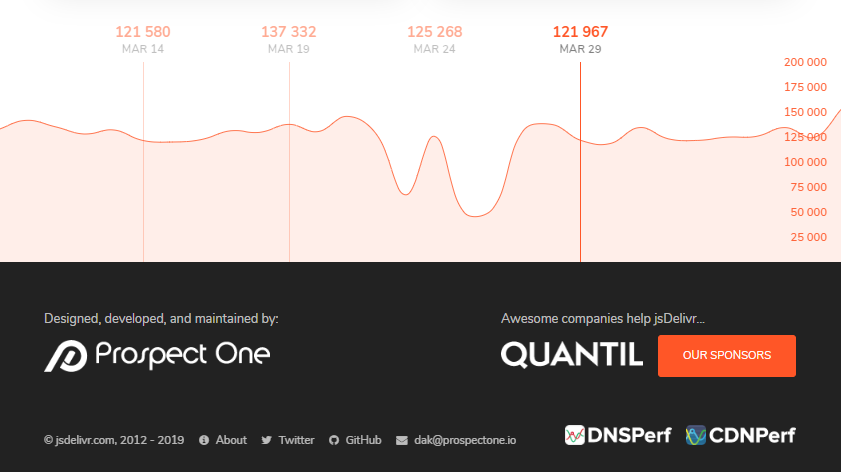

```{r setup, include=FALSE}
source(here::here("_R/blog_setup.R"))
```

I was searching for a CDN at jsdelivr.com and I noticed a chart showing download per days:


```{r, fig.cap="Bottom of https://jsdelivr.com web page", out.extra="class=external", echo=FALSE} 

```

Why I like this chart? Because is a chart integrated
with the web site using all space and soft colors to not
call the attention. A very special chart.

Now we'll try to replicate :). That's why we're are here. Let's
download the data:

```{r}
library(tidyverse)
library(jsonlite)
library(lubridate)

data <- jsonlite::read_json("https://data.jsdelivr.com/v1/package/npm/highcharts/stats/month")

# str(data)

data <- data$versions %>%
  map( ~ .x$dates) %>%
  enframe() %>%
  mutate(value = map(value, enframe)) %>%
  unnest() %>%
  mutate(
    value = map_dbl(value, identity),
    name1 = ymd(name1)
    )

data
```

We'll group the data by day:

```{r}
datag <- data %>%
  group_by(name1) %>%
  summarise(value = sum(value)) %>% 
  rename(
    date = name1,
    downloads = value
  )

datag
```

And we're ready to our first try:

```{r}
hc <- hchart(datag, "line", hcaes(date, downloads))
hc
```

> Just According to Keikaku

Now, there are some changes we need to do:

- Change line to area spline.
- Put every axis in the opposite side.
- Clean the axis and use a bigger font size.
- Remove the lables and reduce number of axis ticks.
- A lot of tweaks!
- And the most important step in this chart: use all the space,
reducing the margins and move the x-axis labels to the inner side. Using the `l-screen`
option in distill package.

```{r, layout="l-screen", out.height=2}
color_theme <- "#E76235" # extracted with chrome extension

hchart(datag, "areaspline", hcaes(date, downloads), name = "Downloads") %>% 
  hc_xAxis(
    title = list(text = NULL),
    opposite = TRUE,
    gridLineWidth = 1,
    gridLineColor = color_theme, # vertical lines
    tickColor = color_theme,
    lineColor = "transparent",  # horizontal line,
    labels = list(style = list(color = color_theme, fontSize = "16px")),
    tickInterval = 8 * 24 * 3600 * 1000 # interval of 1 day (in your case = 60)
    ) %>%
  hc_yAxis(
    title = list(text = ""),
    opposite = TRUE,
    gridLineColor = "transparent",
    showFirstLabel = FALSE,
    labels = list(
      style = list(color = color_theme, fontSize = "16px"),
      align = "left",
      x = -100
    )
  ) %>%
  hc_plotOptions(
    series = list(
      color = color_theme,
      fillColor = hex_to_rgba(color_theme, 0.20),
      marker = list(enabled = FALSE)
    )
  ) %>%
  hc_chart(
    spacingBottom =  0,
    spacingLeft =  -6,
    spacingRight =  -55 # just plying to get these numbers
  ) %>% 
  hc_size(height = 300)
```

I'm happy with the result! Is there something we forget?
