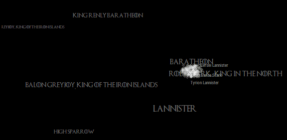
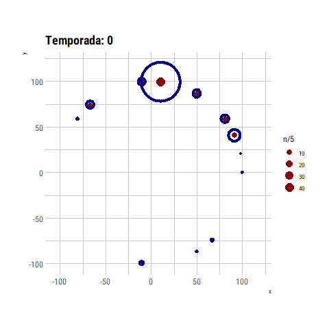

```{r setup, include=FALSE}
source(here::here("_R/blog_setup.R"))
knitr::opts_chunk$set(layout = "l-body")
```

```{r, echo=FALSE, fig.cap="gganimate: worth to try it and learn it", out.extra="class=external",}

```

## Disclaimers

- I know the animation is not then best way to visualiza data! Don't judge me please! But is fun to play with.
- I don't follow the series so I don't know if the results or animations makes any sense.

## Introduction and Idea

Why use GOT data? Because I was participating in #datosdemiercoles which is the
spanish version of #tidytuesday. So the data is given and the purpouse is to learn new
packages using that data and share with the community, you know this already, right?

Secondly the package I want to learn beside {ggforce} is {gganimate} so a very first idea
was represent every character as a point and move according the actual affiliations. A kind of 
~~copy~~ inspiration from 
FlowingData's A Day in the Life of Americans^[https://flowingdata.com/2015/12/15/a-day-in-the-life-of-americans/]

<aside>
Inspiration by Flowindata
```{r, echo=FALSE}
knitr::include_graphics("https://i2.wp.com/flowingdata.com/wp-content/uploads/2016/08/floaty-bubbles-featured.gif?fit=720%2C449&ssl=1")
```
</aside>

## The data, the wrangling and the cleaning

The data come from [this post](https://medium.com/@matthewlunkes/a-game-of-data-visualizations-243c3d8ceb1e) 
where the shifting affiliations are visualized using an alluyvial diagram. It's a nice post by 
[Matthew Lunkes](https://medium.com/@matthewlunkes) where he tell all the process to get the final chart:

```{r, echo=FALSE, fig.cap="Chart by Matthew Lunkes", out.extra="class=external",}
knitr::include_graphics("https://cdn-images-1.medium.com/max/2560/1*gJxTRX_NmrKmHFxamJYvyg.png")
```

In this case the data can be downloaded from this repository https://github.com/MattLunkes/GoT_Affiliations.

```{r}
library(tidyverse)

data <- read_csv("https://raw.githubusercontent.com/MattLunkes/GoT_Affiliations/master/got_char.csv")
data
```

As we see, the data comes in a not tidy way so `gather` is our friend here.


```{r}
data_long <- data %>%
  janitor::clean_names() %>% 
  rename(end_of_s0 = starting_affiliation) %>%
  select(-episodes, -origin) %>% 
  gather(season, affiliation, -name) %>% 
  mutate(
    season = as.numeric(str_extract(season, "\\d+")),
    affiliation = case_when(
      affiliation == "King Robert Baratheon" ~ "Baratheon",
      affiliation == "Viserys Targaryen" ~ "Targaryen",
      affiliation == "King Joffrey Baratheon" ~ "Lannister",
      affiliation == "Daenerys Targaryen" ~ "Targaryen",
      affiliation == "Night's Watch" ~ "Night's Watch",
      affiliation == "Other, Westeros" ~ "Westeros",
      affiliation == "Wildlings" ~ "Wildlings",
      affiliation == "King Tommen Baratheon" ~ "Lannister",
      affiliation == "Petyr Baelish, Lord Protector of the Vale" ~ "The Vale",
      affiliation == "Other, Essos" ~ "Essos",
      affiliation == "Roose Bolton, Lord Paramount of the North" ~ "Bolton",
      affiliation == "Queen Cersei Lannister" ~ "Lannister",
      affiliation == "Jon Snow, King in the North" ~ "Stark",
      TRUE ~ affiliation
      )
    )

# there are some repeated characters?
data_long <- data_long %>% 
  semi_join(count(data, Name) %>% filter(n == 1), by = c("name" = "Name")) %>% 
  # importante for the ggrepel part
  arrange(season, name, affiliation)

data_long
```


## Affiliations Positions

At the beginning I think use a circular layout and see what happend but the result
was far for beign interesting, and as we can see I was a **failure** in my first attempt using
{gganimate}.

```{r, echo=FALSE, fig.cap="#notsogood @accidental__art", out.extra="class=external",}

```

<iframe src="https://giphy.com/embed/cUVNl0if4WqLC" width="452" height="480" frameBorder="0" class="giphy-embed" allowFullScreen></iframe><p class="caption"><a href="https://giphy.com/gifs/game-of-thrones-gif-cUVNl0if4WqLC">via GIPHY</a></p>

Well, so the next idea and step was to get closer the affilations related. How can be two
affiliations be related? An answer can be the the amount of characters which move from
one to another.

```{r}
ts <- data_long %>% 
  distinct(season) %>% 
  pull() %>% 
  head(-1)

change_season <- map_df(ts, function(t = 0){
  
  full_join(
    data_long %>% filter(season == t),
    data_long %>% filter(season == t + 1),
    by = "name", 
    suffix = c("_before", "_actual")
  ) %>% 
    count(from = affiliation_before, to = affiliation_actual) %>% 
    filter(complete.cases(.)) %>% 
    mutate(season = t)
  
})

change_total <- change_season %>% 
  group_by(from, to) %>% 
  summarise(n = sum(n)) %>% 
  ungroup()

change_total
```

Now, with this data we can use the {igraph} package and
the `graph_from_data_frame` function to get a graph from the previous 
data frame and then get a layout.

```{r}
library(igraph)

g <- graph_from_data_frame(change_total, directed = FALSE)

# https://igraph.org/r/doc/strength.html
E(g)$weight <- pull(change_total, n)
V(g)$degree <- degree(g)

V(g)$label.cex <- 0.5

plot(g)
```

Nice! but we need the positions instead of the image. So we'll use
the `layout_with_fr` to get some layout of our graph.


```{r}
set.seed(123)
layout <- layout_with_fr(g)

affiliations <- tibble(
  affiliation = V(g)$name,
  x = layout[, 2],
  y = layout[, 1],
  degree = degree(g)
)

affiliations <- data_long %>% 
  count(affiliation) %>% 
  left_join(affiliations, ., by = "affiliation")

affiliations
```

At this point we are ready to use ggplot and check!

```{r}
p1 <- ggplot(affiliations, aes(x, y, color = affiliation, label = affiliation, size = degree)) +
  geom_point() +
  geom_text() +
  scale_size(range = c(1, 4)) +
  theme(legend.position = "none") +
  labs(title = "igraph laytout")
p1
```

This is really an improvement from the the circular layout. The downside is the main
affiliations are too close so the text is overlaping. A simple solution to this 
was generate an *equidistant sequence* for every set of coordinates, $x$ and $y$.

```{r}
affiliations <- affiliations %>% 
  arrange(y) %>% 
  mutate(y = seq(1:n())) %>% 
  arrange(x) %>% 
  mutate(x = seq(1:n())) %>% 
  mutate_at(vars(x, y), ~ (.x - mean(.x))/sd(.x))
```

We can compare the results:

```{r, echo=FALSE, layout = "l-page"}
library(gridExtra)

p2 <-  ggplot(affiliations, aes(x, y, color = affiliation, label = affiliation, size = degree)) +
  geom_point() +
  geom_text() +
  scale_size(range = c(1, 4)) +
  theme(legend.position = "none") +
  labs(title = "Layout with equidistant sequence")

grid.arrange(p2, p1, nrow = 1)
```

Happy with the effect of a simple fix for the overlaping text. And I think this
change keep the *spirit* of the original graph's shape.


## Character positions

To get the character positions for every step/time/season we decided to put them
in the corresponding affiliation making a circle around it and then adding a
random noise


```{r}
get_reg_poly_coords <- function(sides = 5, radius = 1, x0 = 0, y0 = 0) {
  # https://stackoverflow.com/a/7198179/829971
  x <- radius * cos(2*pi*(1:sides)/sides) + x0
  y <- radius * sin(2*pi*(1:sides)/sides) + y0
  return(tibble(x, y))
}

characters <- data_long %>% 
  count(season, affiliation) %>%
  mutate(coords = map2(n, 1/nrow(affiliations), get_reg_poly_coords)) %>% 
  unnest() %>% 
  select(-season, -affiliation) %>% 
  bind_cols(data_long, .) %>% 
  left_join(affiliations, by = c("affiliation"),  suffix = c(".character", ".affiliation")) %>% 
  mutate(
    x = x.character +  x.affiliation,
    y = y.character +  y.affiliation
  ) %>% 
  mutate_at(vars(x, y), ~ .x + runif(length(.x), -1, 1)/nrow(affiliations))
```


```{r}
p <- ggplot() +
  geom_point(aes(x, y, color = affiliation), alpha = 0.5, data = characters) +
  geom_text(aes(x, y, size = n, label = affiliation), alpha = 0.5, data = affiliations) +
  scale_size_area() +
  scale_color_viridis_d() +
  theme(legend.position = "none")
p
```

Nice! We are almost there.

## Some details before the magic

To get a very style GOT theme we need first the font, you can download
from this link https://fontmeme.com/fonts/game-of-thrones-font/.^[Thanks to (violetrzn)[https://twitter.com/violetrzn], https://github.com/violetr/tidytuesday/blob/master/datosdem2.R#L8]
and use it with the {extrafont} package.

We'll select some important characters to use with {ggrepel} package:

```{r}
main_characters <- data %>%
  select(name = Name, Episodes) %>% 
  arrange(desc(Episodes)) %>%
  head(5)

knitr::kable(main_characters)
```

## Animation is HERE

First we need some setup for the font and colors.

```{r}
library(extrafont)
loadfonts(device = "win") # yeah, win! :/

font <- "Game of Thrones"
font2 <- "Roboto Condensed"
bckground <- "black"
color1 <- "#959394"
color2 <- "white"
seed <- 123

theme_set(theme_gray())
```

Then, the usual {ggplot2} syntax.

```{r}
p <- ggplot() +
  # maint characters labels
  ggrepel::geom_text_repel(
  # geom_text(
    aes(x, y, label = name),
    seed = seed,
    # box.padding = .5, force = 0.25,, max.iter = 5000,
    color = color1,
    size = 3,
    family = font2,
    vjust = "inward", hjust = "inward",
    data = semi_join(characters, main_characters, by = "name")
  ) +
  # https://stackoverflow.com/a/34398935/829971
  # maint characters points
  geom_point(
    aes(x, y),
    size = 3,
    alpha = 0.50,
    color = color2,
    stroke = 0,
    shape = 16,
    data = semi_join(characters, main_characters, by = "name")
  ) +
  # rest of points
  geom_point(
    aes(x, y),
    size = 3,
    alpha = 0.20,
    color = color2,
    stroke = 0,
    shape = 16,
    data = anti_join(characters, main_characters, by = "name") 
  ) +
  # labels affiliations
  geom_text(
    aes(x, y + 3 / nrow(affiliations), label = affiliation, size = degree),
    data = affiliations,
    color = color1,
    alpha = 0.80,
    family = font
  ) +
  scale_size(range = c(2, 5)) +
  labs(
    title = "#",
    caption = "#DatosDeMiercoles por @jbkunst\njkunst.com",
    x = NULL,
    y = NULL
  ) +
  theme(
    legend.position = "none",
    panel.border = element_blank(),
    panel.background = element_blank(),
    panel.grid = element_blank(),
    axis.text.x = element_blank(),
    axis.text.y = element_blank(),
    axis.ticks = element_blank(),
    rect = element_rect(fill = bckground, color = bckground),
    text  = element_text(family = font, colour = color1, size = 15),
    plot.title = element_text(family = font, colour = color1, size = 25),
    plot.subtitle = element_text(family = font2, colour = color1, size = 13),
    plot.caption = element_text(family = font2, colour = color1, size = 10),
  )
```

Finally add the {gganimate} magic:

```{r}
library(gganimate)

p <- p +
  labs(subtitle = "Affiliation changes in season {trunc(frame_time)}") +
  transition_time(season) +
  shadow_wake(wake_length = 0.005, alpha = TRUE, exclude_layer = 1) +
  ease_aes("exponential-in-out")
```

For test purposes I recommend reduce de `fps` to 10, and `duration`
as much you can according how many frames you are using so you can 
to check if the output animation is what you want quickly, then 
for the final output use at least 30 fps to get a smooth transition.

```{r, eval=FALSE}
animate(p, fps = 30, duration = 8*3, width = 1000, height = 800)
```


```{r, include=FALSE, eval=FALSE}
anim_save(
  animation = p, fps = 30, duration = 8*3, width = 1000, height = 800, filename = "images/got-shifting-gganimate.gif"
  )
```

And voilà:

```{r, layout="l-body", echo=FALSE}
knitr::include_graphics("images/got-shifting-gganimate.gif")
```


