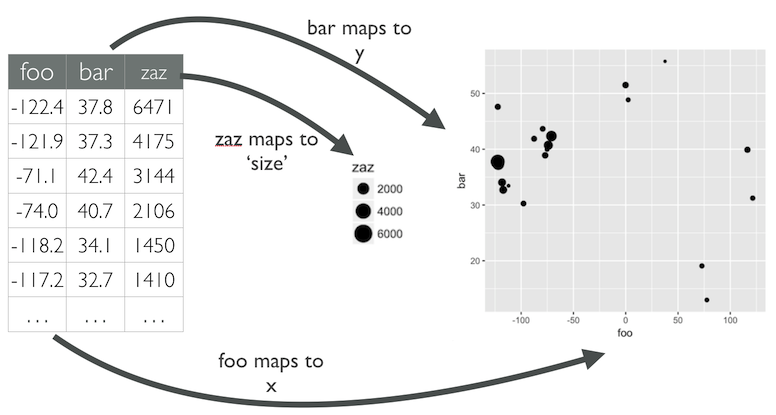

```{r setup, include=FALSE}
source(here::here("_R/blog_setup.R"))
knitr::opts_chunk$set(layout = "l-body-outset")
```

## Introducción

Agradecer por la iniciativa a la comunidad de [R4DS_es](https://twitter.com/R4DS_es) <3:

```{r, echo=FALSE, fig.cap="30 días de gráficos! Yay!", out.extra="class=external"}
try(knitr::include_graphics("images/listado30graficosaldia.jpg"))
```

Este post es muy espacial pues cumpl(e|irá|iría) muchas características.

- Será el primero en español en este blog! 
- Haré la mayoría de gráficos con el paquete [{highcharter}](http://jbkunst.com/highcharter), 
intentando ser lo más claro posible con el fin de que sirva también como 
introducción, casos de usos y ejemplos para el paquete. Partiremos de menos a más:
desde las funciones básicas, complementando luego con mejores práctivas y agregando
funcionalidades desde le mundo Javascript y HTML.
- También comentaremos usos y cuidados de cada uno de los tipos de gráficos para
que esto también sea termine siendo una ayuda al comenzar este viaje en el
mundo de la visualización. Dicho lo anterior intentaré ir siempre dando
link de material de ayuda a buenas fuentes de información.

Así que sin más, vamos a cargar los paquetes necesarios que en este caso 
serán {datos} para los data frames, {highcharter} y {ggplot2} para graficar
y {dplyr} para la manipulación de datos. Eventualmente utilizaremos otros 
paquetes como {lubridate} o {forcats} a medida que necesitemos de ellos.


```{r}
# ejecutar estas líneas para poder instalar {datos}
# install.packages("remotes")
# remotes::install_github("cienciadedatos/datos")

library(datos)       # datos
library(highcharter) # gráficos
library(ggplot2)     # más gráficos  
library(dplyr)       # manipulación de datos
```

## Día 1: barras/columnas

El gráfico más popular, quizás el más fácil de leer. Algunas consideraciones:

- Generalmente se utliza para visualizar conteos o cantidades agrupadas.
- No es recomendable usar muchas categorías. Obviamente dependerá del espacio
pero la idea es no generar tantas barras para seguir viendo las categorías

```{r}
conteo_clases <- count(millas, clase)
conteo_clases
```

Ahora teniendo listo del _data frame_, usaremos la función `hchart` del paquete
highcharter. La forma de utilizarlo es `hchart(dataframe, tipografico, hcaes(mapeo))`

De esta forma obtenemos nuestro gráfico interactivo con {highcharter}:

```{r}
hchart(conteo_clases, "column", hcaes(x = clase, y = n))
```

En un gráfico de barras usualmente se ordenan los conteos y siempre es bueno dar
más contexto a la visualización con un título y/o súbtítulo. 
Para lo primero reordenaremos  los registros de forma descente con la función y 
convertiremos la variable `clase` en un factor cuyos niveles estén ordenados 
según cantidad de vehículos. Para agregar el título usaremos la función 
`hc_title` usando el argumento `text`:


```{r}
library(forcats) # para usar la función fct_inorder

conteo_clases <- conteo_clases %>% 
  arrange(-n) %>% 
  mutate(clase = fct_inorder(clase))

hc01 <- hchart(conteo_clases, "column", hcaes(x = clase, y = n), name = "Conteo") %>% 
  hc_title(text = "Conteo de tipos de automóviles en los datos 'millas'")

hc01
```

## Día 2: líneas

Otro clásico. El gráfico de lineas se utiliza generalmente cuando existe una
variable temporal en nuestros datos. También tiene sus variaciones como los
slopecharts o bumpcharts.

Los datos que utilizaremos corresponden de paises del paquete {datos}, que 
orignalmente pertencen al {gapminder}. Para simplificar la información
agrouparemos por continente y año para obtener un promedio ponderado
por la población de cada país.

```{r}
continentes <- paises %>% 
  group_by(anio, continente) %>% 
  summarise(
    pib_per_capita_pond = weighted.mean(pib_per_capita, poblacion),
    esperanza_de_vida_pond = weighted.mean(esperanza_de_vida, poblacion)
  )

continentes
```

En esta oportunidad utilizaremos `group = continente` al realizar el mapeo para
separar los datos según esta variable.

```{r}
hchart(continentes, "line", hcaes(anio, esperanza_de_vida_pond, group = continente))
```

¿Qué podemos mejora? ¡Mucho! Por ejemplo es dificil comparar para un mismo año,
los valores aparecen con muchos decimales, podemos mejorar las leyendas para 
que sea más fácil asociar las líneas, colores y continentes, para eso usaremos
la funciòn `hc_tooltip` para modificar el tooltip y `hc_legend` para mejorar
las leyendas

```{r}
hc02 <- hchart(continentes, "line", hcaes(anio, esperanza_de_vida_pond, group = continente)) %>% 
  hc_tooltip(table = TRUE, valueDecimals = 2) %>% 
  hc_legend(layout = "proximate")

hc02
```


## Día 3: puntos/burbujas

Seguimos con los gráficos tradicionales. El gráfico de puntos o scatter plot 
se utiliza generelamente para observa la relación entre dos variables 
continuas. Luego el gráfico se puede complementar/complejizar agregando tamaño,
forma, colores a los puntos para agregar más información.

```{r}
paises_2007 <- filter(paises, anio == 2007)
paises_2007
```

De la forma usual, utilizaremos la función `hchart`:

```{r}
hchart(paises_2007, "scatter", hcaes(pib_per_capita, esperanza_de_vida, group = continente))
```

Es un buen gráfico para patir ¿no? Ahora intentaremos:

- Agregar información de la población a través del tamaño del punto (mapeo!).
- Utilizar _captions_ para dar contexto o una explicación de lo que se puede observar.
Utilizaremos código _HTML_, esto es tags como: `<b></b>` para negrita `<i></i>` para
itálicas, `<br/>` para salto de línea, etc. existen muchos y nunca están de más conocerlos.
- Simplificar el tooltip indicando solamente el nombre del país, para esto
utilizaremos el argumento `pointFormat` en la función `hc_tooltip` dando como
valor `"{point.pais}"`: `{}` indica que será un valor dinámico (bien simplificado
este comentario), `point` siempre va pues se refiere al punto que el tooltip 
se está refiriendo, finalmente `pais` para señalar que utilizaremos esta
columna del data frame.
- Finalmente, cuando existen variables que son *asimétricas* -están cargadas 
hacia un lado- es bueno probar cambiando la escala del eje, en nuestro caso el
PIB. Acá será útil nuevamente el _caption_ para recordar que se está usando
escala logarítmica. Esto se hace con simplemente `hc_xAxis(type = "logarithmic")`.


```{r}
texto_explicativo <- "El gráfico nos muestra la relación entre el 
<b>PIB percápita</b> y la <b>Esperanza de vida</b> para países en el año 2007.
Se observa que la gran cantidad de paise con baja esperanza de vida pertenecen
al continente Africano de los cuales la mayoría posee bajo PIB per cápita.<br/>
Para <b>PIB percápita</b> se está utlizando una escala <i>logarítmica</i> debido
a la asimetría de esta variable."

hc03 <- hchart(
  paises_2007, 
  "scatter",
  hcaes(pib_per_capita, esperanza_de_vida, group = continente, z = poblacion),
  maxSize = 30 # para fijar y setar el tamaño máximo
  ) %>% 
  hc_tooltip(pointFormat = "{point.pais}") %>% 
  hc_caption(text = texto_explicativo) %>% 
  hc_title(text = "Relación entre PIB y Esperanza de vida") %>% 
  hc_xAxis(type = "logarithmic")

hc03
```

## Día 4: gráficos con facetas

Las facetas son una buena forma de _desaturar_ un gráfico con mucha información
visual creando pequeños graficos particionando los datos. En este caso, no son 
muchos los paquetes o librerías que manejan tan bien esta característica o 
funcionalidad como {ggplot2}. En el caso de {highcharter} esta funcionalidad
es limitada además manual, teniendo como solución realizar gráficos por separado
y luego mostrándolos todos juntos.

Siguiendo con {ggplot2}, esta se realiza _automágicamente_ con la función
`facet_wrap` (existe también `?facet_grid`) indicando por que variable partcionar
los datos. Un tip que veces se utiliza es
plotear todos los datos en cada faceta con un color suave con el fin de 
comparar la distribución o forma de los datos particulares de la faceta
con el total. Esto se hace agregando una capa (`geom`) del mismo tipo
con unos datos que no posean la variable para realizar las facetas; que 
en nuestro ejemplo es `Especies`:


```{r}
flores_auxiliar <- flores %>% 
  select(Largo.Sepalo, Ancho.Sepalo)

ggplot(flores) +
  geom_point(aes(Largo.Sepalo, Ancho.Sepalo), color = "gray90", data = flores_auxiliar, size = 1) +
  geom_point(aes(Largo.Sepalo, Ancho.Sepalo, color = Especies), size = 1.5) +
  scale_color_viridis_d(end = 0.8) +
  facet_wrap(vars(Especies)) +
  labs(title = "Distribución de Largo y Ancho de Sépalo según Especies")
```


**Medio/Avanzado**. Si quisiéramos realizar de todas formas con {highcharter}, 
una solución sería la siguiente: crear ejes 3 ejes, una para cada especies/grupo 
y luego asignar para cada grupo un eje.

```{r}
hc04 <- hchart(
  flores, 
  "scatter",
  hcaes(Largo.Sepalo, Ancho.Sepalo, group = Especies),
  yAxis = c(0, 1, 2) # parte clave para asignar cada grupo a cada eje Y
  ) %>% 
  # esta es la parte donde se crean *manualmente* 3 ejes.
  hc_yAxis_multiples(
    create_yaxis(
      naxis = 3,
      lineWidth = 2,
      title = purrr::map(0:2, ~list(text = "Ancho.Sepalo"))
      )
  ) %>% 
  hc_title(text = "Distribución de Largo y Ancho de Sépalo según Especies")

hc04
```


## Día 5: diagrama de arcos

Los diagrama de arcos son un caso de especial de _layout_ al graficar redes. 
_Layout_ se refiere a la distribución visual de nodos (o vertices) y aristas. 
Las redes muestran relacion entre pares de observaciones en los datos. 

**En lo personal** el layout no me agrada mucho pues no lo considero algo que 
aporte. De todas formas existe mucha documentación para realizar este tipo de
gráficos con {ggplot2} con ayuda de la librería {ggraph} cuya documentación está 
[acá](https://ggraph.data-imaginist.com/index.html).

## Día 6: donut

¿A quien no le gustan las donas? Los gráficos de donut son un caso especial
de los gráficos de pie en el cual se remueve parte del centro el cual reduce
la distorción (visual) al percibir las cantidades. Este gráfico, al igual que
el pie, se utiliza generalmente para demostrar la distribución de un total.

Para realizar un gráfico de donut con {highcharter} se debe considerar lo 
siguiente:

- Hace un gráfico de tipo "pie" utilizando los argumentos `name` e `y` en el 
mapeo para la categoría y cantidad respectivamente.
- Usar el argumeno `innerSize` con algún porcentaje para cuanta área remover y 
así obtener un gráfico de donut.
- En este caso particular, calcularemos el porcentaje como valor y luego con
el paquete {scales} transformaremos ese número en _formato_ procentaje.
- Con el valor anterior lo utilizaremos para crear etiquetas (_labels_)
con más información usando el argumento `dataLabels` con el valor 
`"{point.name}<br>({point.porcentaje})"` esto escribirá algo del tipo: 
"categoría (porcentaje%)" para cada punto.

```{r}
library(scales)

diamantes_cortes <- count(diamantes, corte)
diamantes_cortes <- mutate(diamantes_cortes, porcentaje = percent(n/sum(n)))

diamantes_cortes

# para un pie remover la parte de "innerSize"
hc06 <- hchart(
  diamantes_cortes, "pie", hcaes(name = corte, y = n),
  name = "Corte",
  innerSize = "80%",
  dataLabels = list(format = "{point.name}<br>({point.porcentaje})")
  )

hc06
```

**Medio/Avanzado**. Ahora intentaremos utilizar el espacio interior para 
colocar un tooltip más grande y más _textual_ (como un _knob chart_). Otra parte
importante es utilizar el argumento `positioner` en highcharts con el fin de 
que independiente del valor en el cual el cursor está, éste siempre este al
medio del gráfico.

```{r}
hc06 %>% 
  # con la siguiente opción desactivamos los 'dataLabels' para que no 
  # exista infomración redundante
  hc_plotOptions(
    series = list(dataLabels = list(enabled = FALSE))
  ) %>% 
  hc_tooltip(
    useHTML = TRUE,
    style = list(fontSize = "30px"),
    headerFormat = "",
    pointFormat = "<div style='text-align: center;'>Corte <b>{point.name}</b><br>{point.y} casos<br>{point.porcentaje} del total</div>",
    positioner = JS(
      "function () {
      
        /* one of the most important parts! */
        xp =  this.chart.chartWidth/2 - this.label.width/2
        yp =  this.chart.chartHeight/2 - this.label.height/2
      
        return { x: xp, y: yp };
      
      }"),
    shadow = FALSE,
    borderWidth = 0,
    backgroundColor = "transparent",
    hideDelay = 1000
    )
```


## Día 7: ridgeline

El gráfico de tipo *ridgeline* viene a solucionar la superposición de muchas 
densidades (o histogramas) haciendo distintos ejes x dependiendo de una 
variable. Trabajarlo con {ggplot2} es muy sencillo dada la extensión {ggridges}
por [Claus Wilke](https://twitter.com/clauswilke).

```{r}
# install.packages("ggridges")
library(ggridges)
library(lubridate)

clima <- clima %>% 
  mutate(
    fecha = ymd(paste(anio, mes, dia, paste = "-")),
    mes_fecha = fct_inorder(months(fecha))
  )

gg07 <- ggplot(clima, aes(x = temperatura, y = mes_fecha, fill = stat(x))) +
  geom_density_ridges_gradient(scale = 3, rel_min_height = 0.01) +
  scale_fill_viridis_c(name = "Temp. [F]", option = "C")

gg07
```

Directo y sin mucha complicación.

**Avanzado**. [HighchartsJS](https://www.highcharts.com/) -por tanto {highcharter}-
no soporta este tipo de gráfico... _Pero, pero, peeero_ podemos todavía crearlo 
con ayuda del gráfico anterior. ¡¿Cómo?! Cuando uno grafica una densidad, como el caso
anterior todo la información es traducida a posiciones, colores y otras características, 
las cuales {ggplot2} emplea para realizar finalmente grafico. Gracias a la
funcion `ggplot_build` se puede acceder a dichos datos por lo que se pueden
emplear para graficar con {highcharter}. Por ejemplo acá para dibujar 
la densidad utilizaremos gráficos de àrea. 

```{r}
dd07 <- as_tibble(ggplot_build(gg07)$data[[1]])

glimpse(dd07)

dd07_02 <- dd07 %>% 
  filter(y != ymax) %>%
  filter(abs(y - ymax) >= 0.01) %>%
  select(x, y, ymax, group, density) %>% 
  mutate_all(round, 3) %>%
  arrange(group, x) %>% 
  rename(l = y, h = ymax) 

# transformar el grupo al mes
dd07_02 <- dd07_02 %>% 
  mutate(
    fecha = ymd(paste("2003", group, 1, paste = "-")),
    mes_fecha = fct_inorder(months(fecha))
  )

dd07_02

hc07 <- hchart(
  dd07_02, 
  "arearange",
  hcaes(x = x, low = l - 1, high = h - 1, group = mes_fecha),
  zIndex = 12:1,
  lineWidth = 3
  ) %>% 
  hc_colors(viridis_pal()(12)) %>% 
  # tabla para distribución de datos
  hc_tooltip(
    shared = TRUE,
    useHTML = TRUE,
    headerFormat = "<b>Densidad estimada en {point.x} ºF</b><table>",
    pointFormat = '<tr><td><span style="color:{point.color}">●</span> {series.name}</td><td><b>{point.density}</b></td></tr>',
    footerFormat = "</table>",
    crosshairs = TRUE
    ) %>% 

  # todo esto es para limpiar los markers y halos
  hc_plotOptions(
    series = list(
      marker = list(
        radius = 0,
        enabled = FALSE
        ),
      states = list(
        hover = list(
          halo = list(
            size = 0
          )
        )
      )
    )
  ) %>% 
  hc_legend(layout = "proximate") %>% 
  hc_yAxis(visible = FALSE, min = 0.5) %>% 
  hc_xAxis(title = list(text = "Temperatura ºF")) %>% 
  hc_title(text = "Distribución de temperaturas por mes") %>% 
  hc_subtitle(text = "Datos obtenidos del data frame <pre>clima</pre> del
              paquete datos")

hc07
```


## Anexos

### Mapeo (mapping)

Mapeo o mapping se refiere a asociar una columna de una tabla a una característica
visual de un objeto. Por ejemplo para realizar un diagrama de puntos, uno debe
asociar la posiciòn vertical a una columna, y la posición horizontal a otra columna.
Quizás también asociar el tamaño en otra e incluso el color o forma. Más 
detalles en https://www.sharpsightlabs.com/blog/r-package-think-about-visualization/.

```{r, echo=FALSE, fig.cap="Ilustraciòn mapear", out.extra="class=external"}

```

