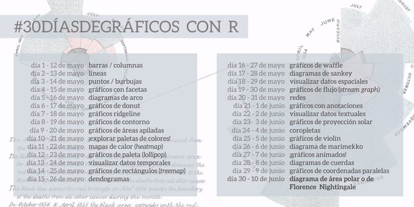

```{r setup, include=FALSE}
source(here::here("_R/blog_setup.R"))
knitr::opts_chunk$set(layout = "l-body-outset")
```

```{r, echo=FALSE, fig.cap="30 días de gráficos! Yay!", out.extra="class=external"}

```

## Introducción

Agradecer por la iniciativa a la comunidad de [@R4DS_es](https://twitter.com/R4DS_es) <3:

Este post es muy espacial pues cumpl(e|irá|iría) muchas características.

- Será el primero en español en este blog! 
- Haré la mayoría de gráficos con el paquete [{highcharter}](http://jbkunst.com/highcharter), 
intentando ser lo más claro posible con el fin de que sirva también como 
introducción, casos de usos y ejemplos para el paquete. Partiremos de menos a más:
desde las funciones básicas, complementando luego con mejores práctivas y agregando
funcionalidades desde le mundo Javascript y HTML.
- También comentaremos usos y cuidados de cada uno de los tipos de gráficos para
que esto también sea termine siendo una ayuda al comenzar este viaje en el
mundo de la visualización. Dicho lo anterior intentaré ir siempre dando
link de material de ayuda a buenas fuentes de información.

Así que sin más, vamos a cargar los paquetes necesarios que en este caso 
serán {datos} para los data frames, {highcharter} y {ggplot2} para graficar
y {dplyr} para la manipulación de datos. Eventualmente utilizaremos otros 
paquetes como {lubridate} o {forcats} a medida que necesitemos de ellos.


```{r}
# ejecutar estas líneas para poder instalar {datos}
# install.packages("remotes")
# remotes::install_github("cienciadedatos/datos")

library(datos)       # datos
library(highcharter) # gráficos
library(ggplot2)     # más gráficos  
library(dplyr)       # manipulación de datos
```

## Día 1: barras/columnas

El gráfico más popular, quizás el más fácil de leer. Algunas consideraciones:

- Generalmente se utliza para visualizar conteos o cantidades agrupadas.
- No es recomendable usar muchas categorías. Obviamente dependerá del espacio
pero la idea es no generar tantas barras para seguir viendo las categorías

```{r}
conteo_clases <- count(datos::millas, clase)
conteo_clases
```

Ahora teniendo listo del _data frame_, usaremos la función `hchart` del paquete
highcharter. La forma de utilizarlo es `hchart(dataframe, tipografico, hcaes(mapeo))`

De esta forma obtenemos nuestro gráfico interactivo con {highcharter}:

```{r}
hchart(conteo_clases, "column", hcaes(x = clase, y = n))
```

En un gráfico de barras usualmente se ordenan los conteos y siempre es bueno dar
más contexto a la visualización con un título y/o súbtítulo. 
Para lo primero reordenaremos  los registros de forma descente con la función y 
convertiremos la variable `clase` en un factor cuyos niveles estén ordenados 
según cantidad de vehículos. Para agregar el título usaremos la función 
`hc_title` usando el argumento `text`:


```{r}
library(forcats) # para usar la función fct_inorder

conteo_clases <- conteo_clases %>% 
  arrange(-n) %>% 
  mutate(clase = fct_inorder(clase))

hchart(conteo_clases, "column", hcaes(x = clase, y = n), name = "Conteo") %>% 
  hc_title(text = "Conteo de tipos de automóviles en los datos 'millas'")
```

## Día 2: líneas

Otro clásico. El gráfico de lineas se utiliza generalmente cuando existe una
variable temporal en nuestros datos. También tiene sus variaciones como los
slopecharts o bumpcharts.

Los datos que utilizaremos corresponden de paises del paquete {datos}, que 
orignalmente pertencen al {gapminder}. Para simplificar la información
agrouparemos por continente y año para obtener un promedio ponderado
por la población de cada país.

```{r}
continentes <- datos::paises %>% 
  group_by(anio, continente) %>% 
  summarise(
    pib_per_capita_pond = weighted.mean(pib_per_capita, poblacion),
    esperanza_de_vida_pond = weighted.mean(esperanza_de_vida, poblacion)
  )

continentes
```

En esta oportunidad utilizaremos `group = continente` al realizar el mapeo para
separar los datos según esta variable.

```{r}
hc <- hchart(continentes, "line", hcaes(anio, esperanza_de_vida_pond, group = continente))
hc
```

¿Qué podemos mejora? ¡Mucho! Por ejemplo es dificil comparar para un mismo año,
los valores aparecen con muchos decimales, podemos mejorar las leyendas para 
que sea más fácil asociar las líneas, colores y continentes, para eso usaremos
la funciòn `hc_tooltip` para modificar el tooltip y `hc_legend` para mejorar
las leyendas

```{r}
hc %>% 
  hc_tooltip(table = TRUE, valueDecimals = 2) %>% 
  hc_legend(layout = "proximate")
```


## Anexos

### Mapeo (mapping)

Mapeo o mapping se refiere a asociar una columna de una tabla a una característica
visual de un objeto. Por ejemplo para realizar un diagrama de puntos, uno debe
asociar la posiciòn vertical a una columna, y la posición horizontal a otra columna.
Quizás también asociar el tamaño en otra e incluso el color o forma. Más 
detalles en https://www.sharpsightlabs.com/blog/r-package-think-about-visualization/.

```{r, echo=FALSE, fig.cap="Ilustraciòn mapear", out.extra="class=external"}
knitr::include_graphics("images/4_bubble-chart_mapping-vars.png")
```

