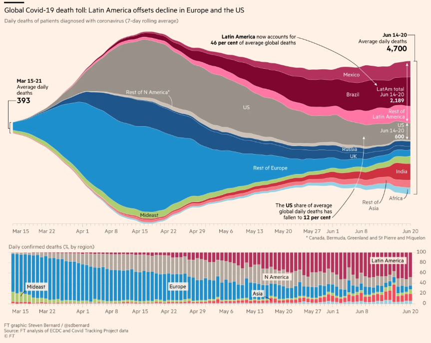

```{r setup, include=FALSE}
knitr::opts_chunk$set(echo = FALSE)
source(here::here("_R/blog_setup.R"))
```

```{r, echo=FALSE}
invisible(Sys.setlocale("LC_TIME", "English"))
```

_Post updated on `r format(Sys.time(), '%b %d, %Y')`_

## Introducction

Week ago I see a tweet from Steven Bernard [@sdbernard](https://twitter.com/sdbernard)
from Financial Times showing a _streamgraph_ on the top of a _stacked column chart_. I take a look
some seconds and then boom: What a combination! Why? 

> One of them is the complement of the other.

The link for the original source is [here](https://www.ft.com/content/aa84f572-f7af-41a8-be41-e835bddbed5b).

```{r fig.cap="Figure from Financial Times article", out.extra="class=external", layout="l-body-outset", echo=FALSE}

```

I like the streamgraph but it is hard to see the change the distribution between
categories when the total change sudden. So have this auxiliar chart is a nice
add to don't loose from sigth the distribution.


## Data

In this post we will use the [Our Workd In Data](https://ourworldindata.org/) 
Covid deaths (link [here](https://ourworldindata.org/covid-deaths)) because
I'm not sure what is the data used by Financial Times team.

We'll load the data and check the structure and get only what we need to 
replitcate the chart:


```{r}
library(tidyverse)
library(lubridate)

data <- readr::read_csv("https://covid.ourworldindata.org/data/owid-covid-data.csv")

# glimpse(data)

data %>% count(continent)

data <- data %>% 
  filter(!is.na(continent)) %>% 
  select(continent, iso_code, date, location, new_deaths)

glimpse(data)
```

FT used the _7-day rolling average_ in the chart so we'll use the {RcppRoll}
package to get that series for each contienent. Check the next code to see how
the function `roll_meanr` works.

```{r}
RcppRoll::roll_meanr(1:10, n = 3)
```

Now we need to group the data to calculate the roll mean for every country/location
and then filter to reduce some noise.

```{r}
data <- data %>% 
  arrange(continent, iso_code, date) %>% 
  group_by(iso_code, continent, location) %>% 
  mutate(
    new_deaths_7day_rollmean = RcppRoll::roll_meanr(new_deaths, n = 7),
    new_deaths_7day_rollmean = ifelse(is.na(new_deaths_7day_rollmean), 0, new_deaths_7day_rollmean),
    new_deaths_7day_rollmean = round(new_deaths_7day_rollmean)
    ) %>% 
  ungroup()

data <- data %>% 
  filter(date >= lubridate::ymd(20200315))
```

The chart show continent so we'll group by date and continent.

```{r}
dcont <- data %>% 
  group_by(date, continent) %>% 
  summarise(
    new_deaths = sum(new_deaths_7day_rollmean)
  ) 

glimpse(dcont)
```


## The streamgraph

Before combine two charts we need to know how to get every chart independently.
Let's start with the main one:

```{r}
library(highcharter)

hchart(dcont, "streamgraph", hcaes(date, new_deaths, group = continent))
```

A good start, but we can do it better. So, some considerations:

- The yAxis don't have a meaning in the streamgraph so we'll remove it.
- We can set `endOnTick` and `startOnTick` en yAxis to gain some extra vertical
space.
- Remove the vertical lines to get a more clear chart.
- Get a better tooltip (`table = TRUE`).
- In this case but we can try adding labels to each series instead of using 
legend, same as the FT chart.
- This is not associate to the chart itself but what is representing: In the
original FT chart some countries like _UK_, _US_ are 
separated for their continent because are relevant, and then the 
color used is similar to their continent to get the visual association.

To separate the information for some coutries from theirs continent we'll
create a `grp` variable:

```{r}
ctry_to_separate <- c("Brazil", "Mexico", "Chile", "United Kingdom", 
                      "United States", "India", "Russia")

data <- data %>%
  mutate(
    grp = ifelse(
      location %in% ctry_to_separate,
      location,
      continent
    )
  )

data %>% 
  count(continent, grp)
```

**Fun part #1**: To the continent which have separated countries will add the
`"Rest of "` to be specific this is no the total continent. 

```{r}
data <- data %>% 
  group_by(continent) %>% 
  mutate(
    grp = case_when(
      all(grp == continent) ~ grp,
      grp == continent ~ str_c("Rest of ", continent),
      TRUE ~ grp
      )
    ) %>% 
  ungroup()

data %>% 
  count(continent, grp)
```

**Fun part #2**: We'll use a specific color for each continent, and a brighten
variation for the the separated countries. For this task the {shades} package 
offer the `brightness` function.

```{r}
# install.packages("shades")
library(shades)

palette <- c("#f1c40f", "#d35400", "#2980b9", "#2c3e50", "#7f8c8d", "#2ecc71")

# data %>% 
#   count(continent, grp)

dlvls_n_clrs <- data %>% 
  group_by(continent, grp) %>%
  summarise(n = sum(new_deaths_7day_rollmean)) %>% 
  # to get the "rest or the continent" first for colors
  mutate(aux = str_detect(grp, continent)) %>%
  arrange(continent, desc(aux), desc(n)) %>% 
  left_join(
    data %>% distinct(continent) %>% mutate(continent_color = palette[1:dplyr::n()]),
    by = "continent"
  ) %>% 
  group_by(continent) %>% 
  mutate(fct = seq(from = 0, to = 0.10, length.out = dplyr::n())) %>% 
  ungroup() %>% 
  rowwise() %>%
  mutate(grp_color = unlist(list(shades::brightness(continent_color, delta(fct))))) %>% 
  mutate(continent_cln = janitor::make_clean_names(continent)) %>% 
  # to get the "rest or the continent" last for order tooltip
  arrange(continent, aux, desc(n))
 
knitr::kable(dlvls_n_clrs)
```

Then exctract some vectors:

```{r}
lvls <- pull(dlvls_n_clrs, grp)
cont <- pull(dlvls_n_clrs, continent_cln)

cols1 <- dlvls_n_clrs %>% filter(aux) %>% pull(grp_color)
cols2 <- dlvls_n_clrs %>% pull(grp_color)
```

Before continuing let's see the original colors and the finishes obtained
with the {shades} package.

```{r, fig.cap="Original palette"}
scales::show_col(cols1, labels = FALSE, borders = FALSE, ncol = 2)
```

```{r, fig.cap="Colors considering variations"}
scales::show_col(cols2, labels = FALSE, borders = FALSE)
```

The colors and levels are ready so let's regroup the data using this 
new `grp` variable:

```{r}
dcont_grp <- data %>% 
  mutate(grp = factor(grp, levels = lvls)) %>% 
  group_by(date, grp) %>% 
  summarise(
    new_deaths = sum(new_deaths_7day_rollmean)
  )
```

Then plot the previous chart but now considering all the comments made before.


```{r}
hchart(
  dcont_grp,
  "streamgraph",
  hcaes(date, new_deaths, group = grp),
  # this will be useful in the combine
  linkedTo = cont,
  showInLegend = FALSE,
  label = list(
    enabled = TRUE, minFontSize = 10, maxFontSize = 20,
    style = list(
      fontWeight = 100,
      textOutline = "1px gray",
      color = hex_to_rgba("white", 0.9)
      )
    )
  ) %>% 
  hc_colors(cols2) %>% 
  hc_yAxis(visible = FALSE, startOnTick = FALSE, endOnTick = FALSE) %>% 
  hc_xAxis(gridLineWidth = 0) %>% 
  hc_tooltip(table = TRUE, outside = TRUE)
```

## The stacked column chart

For the stacked column chart we'll use the data which have deaths by continent
(no `grp`). This is a simple chart so the only important part is set `borderWidth`,
`groupPadding`, `pointPadding` to 0 to remove the space between columns.

```{r}
hchart(
  dcont, "column", hcaes(date, new_deaths, group = continent),
  stacking = "percent",
  borderWidth = 0,
  groupPadding = 0,
  pointPadding  = 0,
  id = unique(cont)
  ) %>% 
  hc_colors(cols1) %>% 
  hc_size(height = 300)
```


## The final chart

There are some important things to do before code the final chart:

- Create and add two yAxis using `hc_yAxis_multiples` and `create_yaxis` 
functions. One for each type of series. The two series will share the same xAxis.
- For the column series we'll use the `id` parameter with the `unique(cont)`
value, then in the streamgraph use the `linkedTo` parameter to link the series.
With this the Russia, UK and Rest of Europe series from the streamgraph are 
link with the Europe series from the stacked column chart, so if the user 
click the Europa legend all those series will hide.

```{r}
hcft <- highchart() %>% 
  hc_add_series(
    dcont_grp,
    "streamgraph",
    hcaes(date, new_deaths, group = grp),
    # this will be useful in the combine
    linkedTo = cont,
    yAxis = 0,
    showInLegend = FALSE,
    label = list(
      enabled = TRUE, minFontSize = 10, maxFontSize = 20,
      style = list(
        fontWeight = 100,
        textOutline = "1px gray",
        color = hex_to_rgba("white", 0.9)
        )
      )
  ) %>% 
  hc_add_series(
    dcont, "column", hcaes(date, new_deaths, group = continent),
    stacking = "percent",
    borderWidth = 0.00,
    groupPadding = 0.00,
    pointPadding  = 0.00,
    id = unique(cont),
    yAxis = 1,
    tooltip = list(pointFormat = "")
  ) %>% 
  hc_colors(c(cols2, cols1)) %>% 
  hc_yAxis_multiples(
    create_yaxis(
      naxis  = 2,
      height = c(4, 1),
      sep    = 0.00,
      offset = -20,
      turnopposite = TRUE,
      title  = list(text = NULL),
      visible = c(FALSE, TRUE),
      startOnTick = FALSE,
      endOnTick = FALSE
      )
    ) %>%
  hc_xAxis(type = "datetime", gridLineWidth = 0, title = list(text = NULL)) %>% 
  hc_tooltip(
    # table = TRUE,
    # positioner = JS("function () { return { x: null, y: 50 };}"),
    outside = TRUE,
    shared = TRUE,
    useHTML = TRUE,
    headerFormat = "<small>{point.key}</small><table>",
    pointFormat = str_c("<tr><td style=\"color: {series.color}\">{series.name}: </td>",
                        "<td style=\"text-align: right\"><b>{point.y:0.f}</b></td>"),
    footerFormat = "<tr><td><b>Total</b>: </td><td style=\"text-align: right\"><b>{point.total:0.f}</b></td></tr></table>",
    style = list(fontSize = "0.7em")
    ) %>%
  hc_legend(
    verticalAlign = "top",
    align = "left",
    itemStyle =  list(fontWeight = 500)
    ) %>% 
  hc_title(
    text = "Global Covid-19 death distribution"
  ) %>% 
  hc_subtitle(
    text =  str_c(
      "Daily deaths of people diagnosed with coronavirus (7-day rolling average). ",
      "Ispiration (copied?!) from <a href='https://www.ft.com/content/a26fbf7e-48f8-11ea-aeb3-955839e06441'>Financial  Times</a> and ",
      "data from <a href='https://ourworldindata.org/covid-deaths'>ourworldindata.org</a>."
    )
  ) %>% 
  # remove symbol markers
  hc_plotOptions(
    series = list(
      marker = list(radius = 0, enabled = FALSE, symbol = "circle"),
      states = list(hover = list(halo = list(size = 0)))
    )
  ) 
```

```{r, layout="l-page"}
hcft %>% 
  hc_size(height = 600)
```


```{r echo=FALSE, include=FALSE}
fout <- "docs/htmlwidgets/ft-stream-stacked-column.html"

try(fs::file_delete(here::here(fout)))
try(fs::dir_delete(str_c(stringr::str_remove(here::here(fout), "\\.html"), "_files")))

htmlwidgets::saveWidget(
  hcft,
  file = here::here(fout),
  selfcontained = TRUE,
  title = "Stream-stacked-column"
  )
```

See full screen [here](../../htmlwidgets/ft-stream-stacked-column.html).


